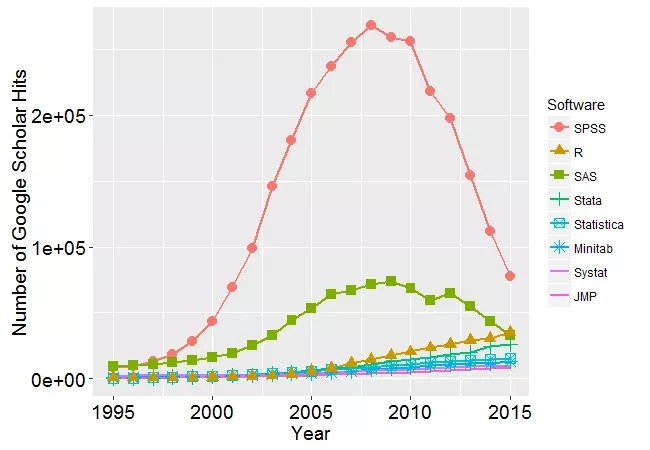
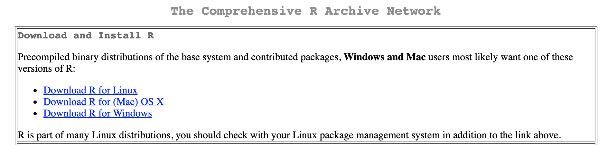
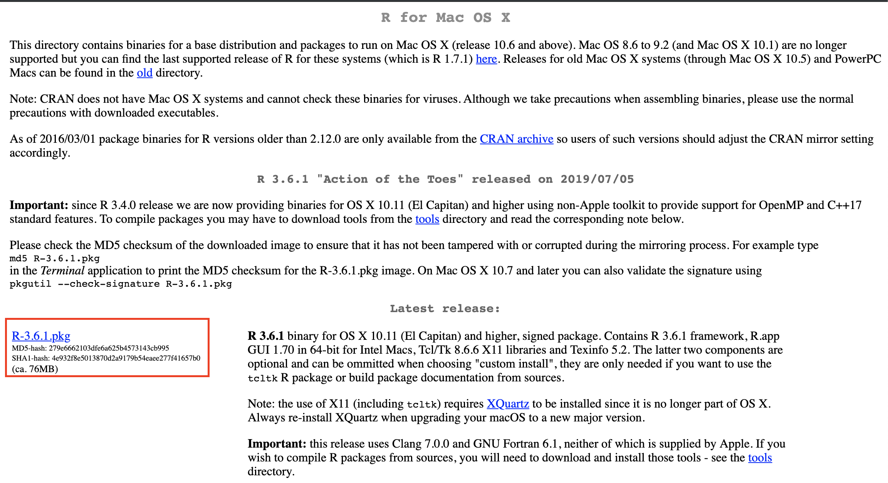
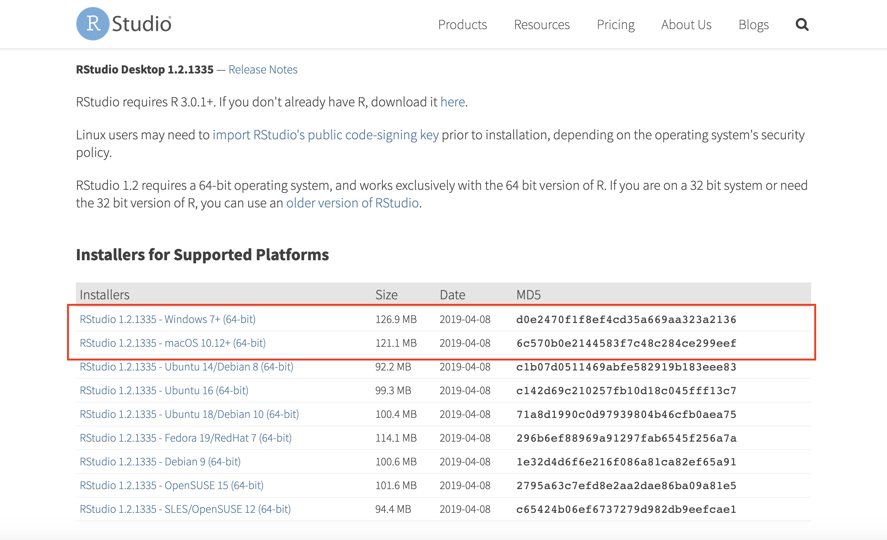
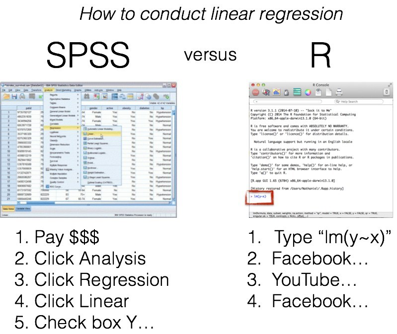
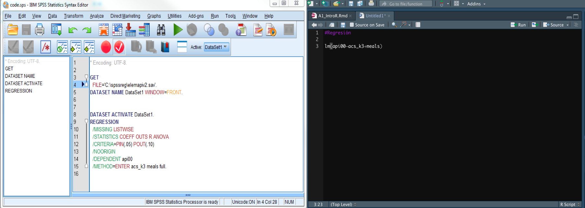
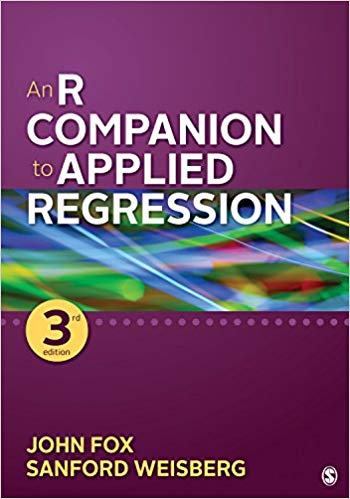

<style type="text/css">
h1.title {
  font-size: 38px;
  color: Dark;
  font-weight:bold;
}
</style>
 
---

# **Objetivos**

1. Presentar el software estadístico `R` como una herramienta para el procesamiento y análisis de datos.
2. Presentar RStudio como medio a partir del cual se utiliza `R`. 
3. Identificar los principales conceptos a la hora de comprender el lenguaje de programación en `R` e interactuar con la plataforma de `RStudio`. 

---

# **¿Qué es `R`?**

Es un entorno y lenguaje de programación gratuito y de código abierto (freeware). Más que un software estadístico como `SPSS` o `STATA`, `R` es un marco para el análisis estadístico con una fuerte orientación a la ciencia de datos. Se crea bajo un nuevo paradigma de ciencia abierta en 1993 por Ross Ihaka y Robert Gentleman con el foco en 4 aspectos claves:

+ **Reproducibilidad**
+ **Transparencia**
+ **Colaboración**
+ **Acceso**

El registro de los análisis queda en formato de texto plano, por lo tanto es independiente de una plataforma para poder editarlo, y además permite un control eficiente de versiones (por ejemplo vía Git). Los análisis operan en base a **paquetes o librerias** (¡actualmente existen más de 3000 librerías disponibles!) y su análisis se orienta principalmente a **objetos** (lo veremos más adelante). 

+ **Google Scholar Hits**



Fuente: [https://i0.wp.com/r4stats.com/wp-content/uploads/2012/04/Fig_2d_ScholarlyImpact.png](Fuente: https://i0.wp.com/r4stats.com/wp-content/uploads/2012/04/Fig_2d_ScholarlyImpact.png)

+ **Google Trends Latinoamérica**


Fuente: [https://arcruz0.github.io/libroadp/](https://arcruz0.github.io/libroadp/)

---

# **Pasos para instalar `R`**

## 1. Visitar la página de [CRAN](https://cran.r-project.org/) (Comprehensive R Archive Network)




---

## 2. Seleccionar versión según sistema operativo


+ **Windows**:


+ **(Mac) OS X**:



---


## 3. Seguir los pasos de instalación indicados para su sistema operativo y abrir R


---

# **¿Qué es `RStudio`?**

Es un entorno de desarrollo integrado para `R` (interfaz gráfica) que permite una navegación más "amigable" y dinámica dentro de la plataforma de R.Cuenta con una consola, editor de resaltado de sintaxis que admite la ejecución directa de código y herramientas para el trazado, el historial, la depuración y la gestión del espacio de trabajo para facilitar el **reporte y reproducibilidad de los análisis**. Esto favorece el desarrollo de procedimientos de ciencia abierta para la investigación. 

---

# **Instalando `RStudio`**

<p style="color:RoyalBlue">
**1. Visitar la página de [RStudio.com](https://www.rstudio.com/products/rstudio/download/#download), descarga y sigue las instrucciones de instalación**
</p>



---

# **Conociendo el entorno de `RStudio`**


---

# **`R` para el análisis de datos sociales**



Fuente: [Fuente: https://www.r-bloggers.com/i-dont-want-to-learn-r-spss-is-fine-responses/](Fuente: https://www.r-bloggers.com/i-dont-want-to-learn-r-spss-is-fine-responses/)

---




---


|         Áreas de comparación             |                                                                                                                                                                                                                                                                      Comentarios                                                                                                                                                                                                                                                               |
|----------------------------------|:-----------------------------------------------------------------------------------------------------------------------------------------------------------------------------------------------------------------------------------------------------------------------------------------------------------------------------------------------------------------------------------------------------------------------------------------------------------------------------------------------------------------------------------------------------:|
|      Curva de aprendizaje         | La interfaz gráfica de `SPSS` permite el uso más intuitivo del programa, mientras que R está orientado al código. Si bien la curva de aprendizaje de `R` es mayor, una vez comprendido su lenguaje se vuelve cada vez más simple incorporar nuevos conocimientos.                                                                                                                                                                                                                                                                                         |
| Variedad de técnicas de análisis | Cuando el objetivo de la investigación exige una técnica estadística más avanzada, `R` tiene ventajas sobre `SPSS`.  Al poseer diversos paquetes estadísticos, la cantidad de técnicas de análisis es superior y como es abierto, cada  vez personas al rededor del mundo contribuyen con nuevas herramientas. Por ejemplo, toda la rama de técnicas de  análisis factorial no se encuentran disponibles en `SPSS`.                                                                                                                                         |
| Herramientas gráficas            | Las capacidades gráficas de `R` son sumamente superiores que las de `SPSS`, ofreciendo una diversidad amplia de  herramientas para poder construir y personalizar las gráficas. `SPSS` ofrece opciones más estándar.                                                                                                                                                                                                                                                                                                                                        |
| Interacción con otros programas  | R brinda la posibilidad de importar datos y/o leer datos desde diferentes formatos porque es compatible con todas las demás interfaces. Así, a través de este se puede trabajar con datos en formatos de `SPSS`, `STATA`, `SAS`, `Excel`, etc.                                                                                                                                                                                                                                                                                                               |
| Masividad del programa           | En Chile, las ciencias sociales y el mercado laboral usan predominantemente `SPSS` para el análisis de datos,  pero el programa `STATA` también fue creció en masividad. En estos mismos dominios, `R` ha aumentado fuertemente su popularidad en los últimos años, principalmente dado que es libre y un programa muy rico en términos de  herramientas.                                                                                                                                                                                                   |
| Costo económico                  | `SPSS` es un programa pagado. Cuesta 99 dólares en su versión base y se pueden agregar hasta tres paquetes  con funciones adicionales por 79 dólares cada uno. `R` por su parte, junto con todas sus funciones y librerías, es gratuito, y `RStudio` también.                                                                                                                                                                                                                                                                                               |
| Filosofía del diseño             | A diferencia de `SPSS`, `R` puede incorporar múltiples funcionalidades según necesidad. Esto se hace a partir de la descarga de paquetes que permiten el uso de variadas herramientas, y exportar los análisis en variados formatos hacia diversos programas computacionales (word, excel, etc.). Otra gran diferencia es que `SPSS` tiene código cerrado. En palabras simples, esto significa que no es posible saber  exactamente qué está haciendo el programa –a no ser que se especifique en algún documento–para calcular los análisis  estadísticos. |

---

# **Interactuando con `R` y `RStudio`**

## Sintaxis

En el archivo de código simple `Rscript` hay caracteres especiales para trabajar y se guarda por defecto con extensión `.R`.

```{r sintaxis, echo=TRUE, eval=TRUE}
# : Comentarios que no se ejecutan como comandos
# + : Sigue el comando en la próxima linea
# ; : Para escribir más de una función en la misma línea
```

---

## Aritmética Básica 

Se puede utilizar para calculadora (este es un simple uso para una plataforma multianálisis).

```{r artimetica base, echo=TRUE, eval=TRUE}
2+3 #Suma
2-3 #Resta
2*3 #Multiplicación
2/3 #División
2^3 #Potencia
```

---

## Funciones

Se pueden utilizar funciones predeterminadas en `R`.

```{r funciones, echo=TRUE, eval=TRUE}
log(1000) #Por DEFAULT es logaritmo natural, en base a euler 2,718.
log(2,718) #Cercano a 1 porque euler elevado a 1 = euler
log(100, base=10)
log10(100)

help("log") #Para saber argumentos
?log

example("log")
#1e-3 = 0,003
#7.2e4 = 72000

args("log")

log(100,10) #= log(100, base=10)
```

---

## Vectores y variables

Objeto unidimensional constituido por elementos del mismo tipo.

```{r vectores, echo=TRUE, eval=TRUE}
c(1) #Vector de un elemento
c(1, 2 , 3 , 4) #Crear un vector

1:4
4:1

seq(1, 4)
seq(4, 1)

-1:2
seq(-1, 2)

seq(2, 8, by=2)

seq(0, 1, by=0.1)

seq(0, 1, length=11)
```

---

## Operaciones con vectores numéricos

```{r operaciones, echo=TRUE, eval=TRUE}
#Operaciones aritméticas
c(1, 2, 3 , 4)/2
(1:4)/2
(1:4)*(4:1)

log(c(0.1, 1, 10, 100), base=10)

c(1, 2 , 3 , 4) + c(4, 3)
c(1, 2 , 3 , 4) + c(4, 3, 2) #Produce warning cuando no son múltiplos
(1:4)*(1:6) #Warning
(1:4)*(1:2)

```

---

## Matrices

Objeto bidimensional constituido por filas y columnas de elementos del mismo tipo.

```{r matrices, echo=TRUE, eval=TRUE}
x <- matrix(1:9,3,3)
x

y <- matrix(1:8,2,4,byrow = F) #Genera una matriz con 2 filas y 4 columnas que se irá completando por columnas
y

z <- matrix(1:8,2,4,byrow = T) #Genera la matriz completándola por filas
z
```

---

## Objetos

R es un programa orientado a objetos, los que son creados por funciones, que en su forma más general sería: `Objeto <- función` o de manera equivalente `Objeto = función`. Hay diferentes tipos de objetos: vectores, factores, matrices, marco/base de datos (entre otros) Veamoslo en el siguiente código: 

```{r objetos, echo=TRUE, eval=TRUE}
##Crear objetos
x <- c(1,2,3,4)
z=c(1,2,3,4)

edad <- c(23, 45, 67, 89)
sexo <- c(1, 1, 0, 1)

edad
sexo
```

---

## Fijar directorio de trabajo

Por temas de reproducibilidad, se recomienda establecer directorio de trabajo (ubicación en el pc), donde se buscan y guardan los archivos que se vayan utilizando y/o creando durante el análisis. 

```{r directorio, echo=TRUE, eval=FALSE}
getwd() # Se obtiene el directorio de trabajo actual
setwd("ruta") # Establecer directorio de trabajo
#Windows
setwd("~\Dropbox\SOL201S_Datos_III\SOL201S_2019\Ayudantia\SOL201S_Datos_3\Ayudantia1") #
#Mac
setwd("~/Dropbox/SOL201S_Datos_III/SOL201S_2019/Ayudantia/SOL201S_Datos_3/Ayudantia1")
```

---

## Librerías o Paquetes

Conjunto de funciones que tienen una relación entre ellas y que usualmente vienen acompañadas de ficheros de ayuda (documentación). Algunas librerías vienen preinstaladas, otras específicas hay que instalarlas de acuerdo a las necesidades del usuario.

```{r paquetes, echo=TRUE, eval=FALSE}
library() #Puedo revisar los paquetes instalados
install.packages("libreria") #Para instalar
library("libreria") #Las librerías se instalan sólo una vez, pero deben ser cargadas si se quieren utilizar en la sesión de trabajo

install.packages("dplyr") #Para manipulación de datos
install.packages("car") #"Companion to Applied Regression" (Fox & Weisberg)
```

Pueden encontrar información de las librerías oficiales de R disponibles según disciplina académica en el siguiente [link](https://cran.r-project.org/web/views/).

Además, para evitar lo de instalar/cargar, hay una librería en R que se llama "pacman" (package manager) que cumple la función de cargar las librerías, o en su defecto, instalarlas y cargarlas.

```{r paquetes2, echo=TRUE, eval=FALSE}
install.packages("pacman") #Sólo la primera vez. Este es un paquete que nos permite administrar otros paquetes.
pacman::p_load(dplyr,
               car) #Cada vez
#El camino más tradicional:
library(dplyr)
library(car)
```

---

# **Links de referencia**

En `R` hay múltiples referencias, paquetes, herramientas y formas de hacer las cosas. Para no intimidarse con tal magnitud de información les dejamos algunos links que pueden ser de ayuda: 

## Libro base del curso

[Fox, John y Sanford Weisberg (2019). An R Companion to Applied Regression. Third Edition. SAGE.](https://www.dropbox.com/sh/t0s4r6yuzgcwt10/AAB9DxspiUmAqihGAITmhQpca?dl=0)



---

## Manuales

Son excelentes herramientas para iniciarse en `R`, te recomendamos revisarlos con calma y tener mucha paciencia y perseverancia. Es un poco difícil entender la lógica del software en un principio pero solo es cosa de práctica. 

- [Boccardo & Ruiz (2018). Uso de RStudio para Estadística Univariada en Ciencias Sociales](https://bookdown.org/gboccardo/manual-ED-UCH/): Manual de apoyo docente para  Estadística Descriptiva. Elaborado por sociólogos es una buena fuente para introducirse al mundo de R. 

- [R para Ciencia de Datos](https://es.r4ds.hadley.nz/): Libro base para el uso de R, aquí podrán ver que la plataforma de Rstudio no es solo una plataforma de análisis estadístico, sino que de procesamiento de datos y reporte.

- [AnalizaR Datos Políticos](https://arcruz0.github.io/libroadp/index.html): Manual con herramientas y tips prácticos para analizar datos políticos.

- [RStudio Cheat Sheets](https://www.rstudio.com/resources/cheatsheets/#ide): Otros recursos en **inglés**.

---

## Foros

Para los que alguna vez fuimos nuevos en `R` y `RStudio` nos sirvió bastante ver las preguntas y respuestas de otras personas en todo el mundo. De hecho, casi todas nuestras preguntas ya fueron respondidas por otras personas (una de las ventajas del paradigma de la ciencia abierta) por lo que solo debemos buscar. Aunque, ojo, la mayoría de ellas están en inglés: 

- [RStudio Community](https://community.rstudio.com/)

- [Stackoverflow](https://stackoverflow.com/questions/tagged/r)

---

## Ayudantías

Puedes encontrar las carpetas con las ayudantías y bases de datos en el siguiente [Link](https://github.com/JDConejeros/SOL201S_Datos_3)  

La próxima ayudantía veremos: 

+ Lectura de Bases de datos
+ Procesamientos de datos (recodificación)
+ Estadística Descriptiva 
+ Introducción a modelos de regresión lineal