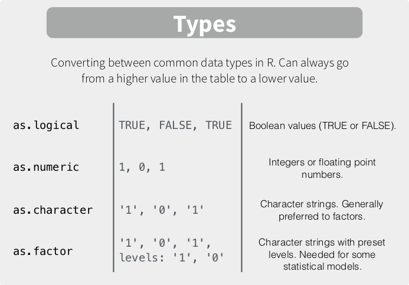
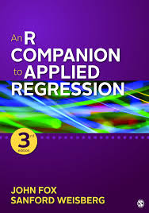

<style type="text/css">
h1.title {
  font-size: 38px;
  color: Dark;
  font-weight:bold;
}
</style>
 
---

# **Objetivos**

1. Reconocer comandos básicos para el uso de `R`
2. Ejercitar comandos básicos de lectura de bases de datos, etiquetar variables y atributos, crear y calcular nuevas variables en `R`. 
3. Ejercitar comandos básicos de estadística descriptiva en `R`. 

---

# **Conceptos claves de la Ayudantía I**

+ `R` ofrece una amplia gama de herramientas para el procesameinto, análisis y reporte de datos de forma económica y de código abierto.
+ `R` es una plataforma que trabaja a través de objetos. Los objetos pueden ser números, listas, vectores, conjuntos de datos, una función matemática o un resumen estadístico como una media o desviación estándar o una prueba estadística.
+  Los objetos vienen en muchas formas y tamaños diferentes en `R`. Hay objetos simples como los que representan números individuales, vectores que representan varios números, marcos de datos que representan tablas de datos e incluso objetos más complejos como pruebas de hipótesis o regresiones que contienen todo tipo de información estadística.

---

# **Ejercicio I: Procesamiento en `R`**

Para esta ayudantía utilizaremos la base `R` y las librerías `dplyr` y `car`

```{r opciones, echo=TRUE, message=FALSE, warning=FALSE}
rm(list = ls()) #Limpiamos la memoria
library(dplyr)#Para manipulación de datos
library(car)#Funciones para estimar regresiones
search() #Revisamos los paquetes y herramientas instaladas

#También podemos ver las funciones de cada paquete
library(help = "base") #Funciones base de R
library(help = "dplyr") #Funciones librería dplyr
library(help = "car") #Funciones librería car

options(scipen=999) #Desactivamos la notación científica
```

En esta oportunidad utilizaremos la base de datos `psu_sample` que es un extracto con información de los estudiantes que rindieron la PSU para el año 2016. Las principales variables de la base de datos son las siguientes: 

+ **Variables Dependientes**: Puntajes en la prueba de lenguaje (`leng`), matemáticas (`mate`) y Ciencias (`cien`). 
+ **Variables Independientes**: sexo, ingreso familiar, dependencia de la escuela, modalidad, educación del padre/madre y clase social del padre/madre.

## Lectura de bases de datos 

**1. Revise su directorio de trabajo actual y genere un nuevo directorio de trabajo en que esté disponible la base de datos y el script de la ayudantía 2.**

```{r dir, echo=TRUE, eval=FALSE}
getwd() # Se obtiene el directorio de trabajo actual
setwd("ruta") # Establecer directorio de trabajo
#Windows
setwd("~\Dropbox\SOL201S_Datos_III\SOL201S_2019\Ayudantia\SOL201S_Datos_3\Ayudantia1") #
#Mac
setwd("~/Dropbox/SOL201S_Datos_III/SOL201S_2019/Ayudantia/SOL201S_Datos_3/Ayudantia1")
```

**2. A partir de su directorio abra la base de datos `psu_sample.Rdata`**

```{r lectura, warning=FALSE, cache=FALSE, results="asis"}
#Cargar una base de datos en R
load("psu_sample.Rdata") #11811 observaciones - 16 variables
#Transformemos nuestro objeto en un marco de datos
psu_sample <- as.data.frame(psu_sample)

#Ejemplo importar base de datos en STATA
library(haven)
psu_sample2 <- read_dta("psu_sample.dta")

#Guardar una base de datos
save(psu_sample, file = "import_psu_sample.Rdata")

#Borrar todos los objetos de la base de datos
rm(psu_sample2) #Borramos la base de datos importada
```

---

## Explorando una base de datos

**3. Explore la base de datos `psu_sample.Rdata`, indique el número de observaciones, variables y realice una exploración inicial de la base. Qué tipo de datos estamos utilizando en esta base de datos?** 

### `View` & `dim`

+ Vista previa del objeto mediante el comando `View`, exploración inicial de la base de datos con el comando `dim`  

```{r bbdd, echo=TRUE, eval=FALSE}
#Veamos nuestro objeto 
View(psu_sample)

#Revisamos las dimensiones de la base de datos
dim(psu_sample) #N y variables
```

### `str`, `colnames`, `head` & `brief`

+ Revisamos las variables de nuestra base de datos a través de los comandos `str`, `colnames`, `head` y `brief`

```{r bbdd2, warning=FALSE, cache=FALSE, results="markup"}
#Revisamos las variables de nuestra base de datos
#str(psu_sample)

#Nombres de las variables en la base de datos
colnames(psu_sample)

#Revisamos las 10 primeras observaciones
head(psu_sample, n=10)

#Revisión general de la base de datos
brief(psu_sample)
```

---

## Procesamiento de datos

**4. En oportunidad trabajaremos con las variables `sexo`, `ingresofamiliar`, `leng`, `mate` y `edad`. Realice un subset con estas variables y mencione que significa cada variable y sus categorías.**

### `subset` & `select`

+ Seleecionar variables de la base de datos

```{r, warning=FALSE, cache=FALSE, results="markup"}
#Selecionar/mantener una lista de variables. Siempre es recomendable generar nuevos objetos para no perder la información de nuestros objetos iniciales.  
colnames(psu_sample) #Consultamos los nombres de nuestras variables
subset_psu_sample <- subset(psu_sample, select = c(sexo,grupo_depend,leng,mate,edad, ingresofamiliar))

#También podemos hacer esto seleccionando el número de las columnas que necesitamos
subset_psu_sample <- subset(psu_sample, select = c(1,4,6,7,11,3))

#Borrar una lista de variables
subset_psu_sample <- subset(psu_sample, select = -c(estado_civil,x_nem,cien,beca,modalidad,jefe_familia,educapadre,educamadre,clasesocialpadre,clasesocialmadre))

#Podemos hacer lo mismo con una función de la librería "dplyr"
subset_psu_sample <- select(psu_sample,c(sexo,grupo_depend,leng,mate,edad,ingresofamiliar))

#Revisamos las variables de nuestra nueva base de datos
dim(subset_psu_sample)
```

**5. A partir de su nueva base de datos genere las siguientes variables con sus respectivos etiquetas y atributos.**

### `recode`

+ Generar nuevas variables y recodificar: Uso del comando `recode`

a. Una variable que identifique el género de los/as entrevistados/as con valor **0 para las mujeres** y valor **1 para los hombres** **¿Qué tipo de análisis bivariado podemos realizar con dos variables cualitativas?** 

Antes de responder la pregunta, vamos a revisar la functión `recode`:

Recupera un vector numérico, un vector de caracteres o un factor de acuerdo con especificaciones de recodificación simples. Recode es un alias para recodificar que evita conflictos de nombres con paquetes, como Hmisc, que tienen una función de recodificación.

¿Cómo utilizar el comando?

`recode(var, recodes, as.factor, as.numeric=TRUE, levels)`

```{r recode, warning=FALSE, cache=FALSE, results="markup"}
#Recode pertenece a la libreria "car". Cargamos la librería
library(car)
#Revisamos el comando recode
?recode
```

Ahora revisemos el ejercicio:

```{r, warning=FALSE, cache=FALSE, results="markup"}
#Obtenemos una tabla resumen de nuestra variable 
#5505 hombres (código 1) y 6306 mujeres (código 2)
#str(subset_psu_sample$sexo)
table(subset_psu_sample$sexo) 

#Generamos una nueva variable a partir de la existente
subset_psu_sample$genero <- subset_psu_sample$sexo

#Recodificamos la variable nueva
subset_psu_sample$genero <-recode(subset_psu_sample$genero, rec="1=1; 2=0")

#Clasificamos esta variable como factor de dos categorías (etiquetas de hombre y mujer)
subset_psu_sample$genero <-factor(subset_psu_sample$genero, levels = c(0,1), labels = c("Mujer", "Hombre"))

#Revisamos nuestra variable final
table(subset_psu_sample$genero) 

#También se puede haber realizado de otra manera (indexando):
subset_psu_sample$genero2 <- subset_psu_sample$sexo
subset_psu_sample$genero2[subset_psu_sample$genero2==1] <- 1 
subset_psu_sample$genero2[subset_psu_sample$genero2==2] <- 0 
subset_psu_sample <- subset_psu_sample[-c(8)]
```

b. Genere una variable *dummy* que identifique con valor **0 los colegios particulares y particular subvencionado** y con valor **1 para los colegios municipales **

```{r, warning=FALSE, cache=FALSE, results="markup"}
#Aplicamos la misma lógica del ejercicio anterior
#Obtenemos una tabla resumen de nuestra variable 
#1548 part.pagado (código 1), 6755 part.subvencionado (código 2) y 3508 municipal (código 3)
#str(subset_psu_sample$grupo_depend)
table(subset_psu_sample$grupo_depend) 

#Generamos una nueva variable a partir de la existente
subset_psu_sample$dependencia <- subset_psu_sample$grupo_depend

#Recodificamos la variable nueva
subset_psu_sample$dependencia <-recode(subset_psu_sample$dependencia, rec="1:2=0; 3=1")

#Clasificamos esta variable como factor de dos categorías (etiquetas de hombre y mujer)
subset_psu_sample$dependencia <-factor(subset_psu_sample$dependencia, levels = c(0,1), labels = c("Part/Sub", "Municipal"))

#Revisamos nuestra variable final
table(subset_psu_sample$dependencia) 
```

**6. Filtre su base de datos solo con las observaciones que provengan de colegios municipales y sean menores de 20 años. Revise su base de datos final. ¿Qué tipo de análisis podemos realizar cuando una variable dependiente es continua?** 

### `dplyr` & `%>%`

+ Uso de tuberías

Una herramienta de procesamiento muy útil son las pipes o tuberías (`%>%`) que se cargan automáticamente con el paquete `dplyr`. Estas tuberías permiten expresar de forma clara una secuencia de múltiples operaciones, así obtenemos un código más limpio, eficientes y fácil de comprender.

**`%>%` -> Esto es un pipe.**

El objetivo de un pipe o tubería es ayudarte a escribir un código que sea más fácil de leer o entender, ya que nos permite encadenar una secuencia de distintas funciones en nuestra base de datos (lógica enfocada en los verbos y no los sustantivos). Pueden encontrar más referencias y ejemplos [aqui](https://es.r4ds.hadley.nz/pipes.html).   

Ejemplo: 

```{r pipe, echo=TRUE, eval=FALSE}
#En un código estamos haciendo tres operaciones distintas.
foo_foo %>%
  saltar(a_través_del = bosque) %>%
  recoger(arriba = ratones_campo) %>%
  golpear(en = la_cabeza)
```

+ Filtrar base de datos

```{r, warning=FALSE, cache=FALSE, results="markup"}
#Filtramos la base de datos con las dos condiciones al mismo tiempo. 
#Operador lógico "&" y utilizamos una tubería
subset_psu_sample2 <- subset_psu_sample %>% 
                          filter(edad < 20 & dependencia == "Municipal") 

#Revisamos nuestras variables
summary(subset_psu_sample2)
```

---

# **Ejercicio II: Estdística Descriptiva en `R`**

## Estadísticos Desriptivos

**7. A partir de la base original, estime cuál es la proporción de mujeres y hombres de la muestra**

+ Removemos los objetos creados

```{r descriptivos, warning=FALSE, cache=FALSE, results="markup"}
rm(subset_psu_sample, subset_psu_sample2)
```

### Variables Categóricas

+ Para una variable categórica:

```{r descriptivos2, warning=FALSE, cache=FALSE, results="markup"}
table(psu_sample$sexo)
prop.table(table(psu_sample$sexo))
```

**8. Estime la proporción de mujeres que estudia en un colegio municipal y la proporción de hombres que lo hace en un colegio subvencionado** 

+ Para dos variables categóricas:

```{r propbiv, warning=FALSE, cache=FALSE, results="markup"}
table(psu_sample$grupo_depend, psu_sample$sexo)

#install.packages("gmodels")  
gmodels::CrossTable(psu_sample$grupo_depend, psu_sample$sexo)
gmodels::CrossTable(psu_sample$sexo, psu_sample$grupo_depend)

```


**9. Estime ahora la cantidad de hombres y de mujeres, solteros(as) que pertenecen a un colegio privado** 

+ Para tres variables categóricas:

```{r probtri, warning=FALSE, cache=FALSE, results="markup"}
ftable(psu_sample$sexo, psu_sample$estado_civil, psu_sample$grupo_depend)
```

**10.  Calcule el promedio de edad de quienes rindieron la PSU, y los puntajes medios obtenidos en lenguaje, matemáticas y ciencia**

### Variables Continuas

+ Medidas de posición central
```{r media, warning=FALSE, cache=FALSE, results="markup"}
#mean(edad) #Es un error típico que se comete
mean(psu_sample$edad)
mean(psu_sample$leng)
mean(psu_sample$mate)
mean(psu_sample$cien)
```


**11. Calcule el promedio del puntaje obtenido en la prueba de lenguaje según sexo y según grupo de dependencia. Luego repita el procedimiento para el promedio del puntaje obtenido en la prueba de matemáticas**

+  Medidas de posición central para variable numérica y categórica

```{r mediacond, warning=FALSE, cache=FALSE, results="markup"}
by(psu_sample$leng, psu_sample$sexo, mean)
by(psu_sample$leng, psu_sample$grupo_depend, mean)

by(psu_sample$mate, psu_sample$sexo, mean)
by(psu_sample$mate, psu_sample$grupo_depend, mean)
```

**12. Dado el potencial riesgo de outliers, calcule la media del puntaje en matemáticas habiendo borrado el 5% extremo**

```{r mediacond2, warning=FALSE, cache=FALSE, results="markup"}
mean(psu_sample$leng, tr=.05) # trim o tr borra una fraccion de observaciones al final. Sirve para eliminar outliers.
```

**13.a Calcule la mediana, la moda, el rango intercuartil, el mínimo y el máximo de la distribución del puntaje en matemáticas**

+ Medidas de posición no central

```{r nocentral, warning=FALSE, cache=FALSE, results="markup"}
median(psu_sample$mate) #Mediada
#install.packages("DescTools")
library(DescTools)
DescTools::Mode(psu_sample$mate) #Moda

quantile(psu_sample$mate)
quantile(psu_sample$mate, c(0.25, 0.75)) #la c es opcional

IQR(psu_sample$mate) #Rango intercuartil
IQR(psu_sample$mate)  #cero porque tiene baja dispersion

summary(psu_sample$mate)
summary(psu_sample)

```


**13.b Estime la dispersión de los puntajes en matemáticas. Además, construya su intervalo de confianza a un 95%. ¿Existen diferencias estadísticamente significativas con la prueba de lenguaje?**

+ Dispersión e intervalos de confianza

```{r ic, warning=FALSE, cache=FALSE, results="markup"}
var(psu_sample$mate)
sd(psu_sample$mate)

##Intervalos de confianza
sd(psu_sample$mate)
106.63/sqrt(11811) #Error estándar
(106.63/sqrt(11811))*1.96 #Margen de error o error típico
mean(psu_sample$mate)-((106.63/sqrt(11811))*1.96)
mean(psu_sample$mate)+((106.63/sqrt(11811))*1.96)
```

**13.c Calcule nuevamente la distribución y dispersión, pero ahora para la variable edad. ¿Qué diferencia notan?**

```{r dispedad, warning=FALSE, cache=FALSE, results="markup"}
summary(psu_sample$edad)
var(psu_sample$mate)
sd(psu_sample$mate)
```

---

# **Ejercicio III: Gráficos Descriptivos en `R`**

## Histogramas

**14.a Compare las distribuciones de los puntajes de lenguaje, matemáticas y ciencia**

+ Histograma para variables numéricas
```{r graphs1, warning=FALSE, cache=FALSE, results="markup"}
#Para variable numerica.
hist(psu_sample$leng)
hist(psu_sample$mate)
hist(psu_sample$cien)
```


**14.b. Revise los outliers en las pruebas de lenguaje, matemáticas y ciencia**

## Boxplots

+ Boxplots de variables 
```{r graphs2, warning=FALSE, cache=FALSE, results="markup"}
boxplot(psu_sample$leng, psu_sample$mate, psu_sample$cien)
```

**14.c. Revise la dispersión de puntajes lenguaje comparando entre mujeres y hombres**

+ Boxplot comparativo entre categorías de variables

```{r graphs3, warning=FALSE, cache=FALSE, results="markup"}
boxplot(leng ~ sexo, data=psu_sample)
```

---

# **Resumen de funciones**

## Comandos de `SPSS` a `R`

| Comando SPSS | Comando Stata | Descripción |
|-------------|----------------------|-------------------------------------------------------------------------------------------------------------------------|
| NA | `getwd()` | Muestra el directorio donde está guardado el archivo abierto |
| NA | `setwd("ruta")` | Muestra el directorio actual o permite configurar uno nuevo |
| Abrir / Guardar | `load("ruta")` / `save(objeto, file = "objeto.Rdata")` | Abrir y guardar una bases de datos en R.  |
| Abrir `SPSS` / Abrir `EXCEL` / Abrir `STATA` | `read_sav("ruta")` / `read_excel("ruta")` / `read_dta("ruta")` | Abrir bases de datos en `Excel`, `SPSS`, `STATA`. Use las librerías: `readxl` y `haven` |
| Ventana vista de variables | `str(objeto)` | Describe la información en la memoria o en un archivo |
| Ventana vista de datos | `View(objeto)` / `head(objeto)` | Describe los contenidos de la base de datos; examina los nombres, etiquetas e información de las variables para producir un libro de códigos (codebook). |
| Analizar -> Estadísticos descriptivos | `summary(objeto)` | Estadísticos de resumen. Información de cantidad de casos, máximo, mínimo, media y desviación estándar de cada variable. |
| Vista de variables -> Clic derecho -> Borrar | `data <- data[-c(variable)]` | Elimina variables (columnas de la base de datos) |
| N/A | `data <- subset(data, select = c(variable1, variable2))` | Selecciona sólo las variables o casos de interés y elimina las variables o casos no seleccionados |
| compute | `data$var_nueva <- data$var_vieja` | Crea o cambia el contenido de una variable; se pueden utilizar fórmulas y expresiones lógicas y matemáticas (&, <, >, +, sum(), etc.) |
| Recodificar en la misma variable | `data$var1 <-recode(data$var1, rec="1=1; 2=0")` | Cambiar una variable existente. Aplica la misma lógica para variables categóricas o continuas. |
| Variable label -> value label | `str(data$var)` | Nombre de las variables y sus atributos. |
| Variable level | `as.numeric()` | Traspasa las variables tipo cadena a variables numéricas (con o sin categorías) |
| Datos -> Ordenar casos | `order(data$variable)` | Organiza las observaciones de los datos actuales en orden ascendente según los valores de las variables en lista de variables |
| N/A | `rm(list = ls())` | Borra las variables y cambios que se hayan realizado; cierra la base de datos abierta. Recordar guardar los cambios antes |
| Datos -> Fundir archivos | `merge` / `rbind` / `cbind` | Combina o funde bases de datos. Merge une dos bases distintas con un identificador. rbind pega las filas de una base de datos y cbind las columnas. |
| Analizar -> Estadísticos descriptivos -> Tablas de contingencia | `table` / `prop.table` | Tabulación de tablas de frecuencia o contingencia.  |
| Analizar -> Tablas personalizadas | `dplyr` | Genera tablas con estadísticos descriptivos a elección en variables cuantitativas. |
| N/A | `%>%` | Permite encadenar una serie de funciones |
| Gráficos -> Generador de gráficos -> Histograma | `hist` | Histograma |
| Gráficos -> Generador de gráficos  Boxplot | `boxplot(data$var1)` | Boxplot |
| Analizar -> Correlaciones bivariadas | `cor(x, y)` | Genera una matriz de correlación para las variables seleccionadas |
| Analizar -> Modelo lineal general | `lm(y ~ x, data=df)` | Calcula una regresión lineal simple o multivariada |
| N/A | `by` | Repite los comandos de Stata en un subconjunto de datas |
| N/A | `in` | Donde esté permitido (casi siempre), ejecuta el comando solo en un grupo de casos seleccionados. (Ejemplo: in 1/20 -> en casos 1 al 20) |
| N/A | `if` | Donde esté permitido, (casi siempre) ejecuta comando en casos que cumplan con las condiciones dadas. |
| N/A | `help(function)` / `?function` | Obtener ayuda sobre algún comando en particular |
| *comentario y/* comentario */ | `#` | Para anotar comentarios en el script. |

---

## Operadores lógicos en `R`

| Operadores lógicos | Significado | Operadores lógicos | Significado |
|--------------------|-------------|--------------------|-------------------|
| `&` | y | `>=` | Mayor o igual que |
| `|` | O | `<=` | Menor o igual que |
| `!` | No | `==` | Igual |
| `~` | No | `!= o ~=` | No igual |
| `>` | Mayor que | `NA` | Valores perdidos* |
| `<` | Menor que | `is.na(data$var)` | Valores perdidos |

---

## Tipos de variables 



---

# **Referencias**

## Libro base de contenidos

[Wooldridge, Jeffrey M. (2009). Introducción a la econometría: un enfoque moderno. 4a edición. Mé́xico: Cengage Learning.](https://www.dropbox.com/sh/t0s4r6yuzgcwt10/AAB9DxspiUmAqihGAITmhQpca?dl=0)

+ Caps A.2, B.3, y 2.1.


## Libro base del curso para el uso R

[Fox, John y Sanford Weisberg (2019). An R Companion to Applied Regression. Third Edition. SAGE.](https://www.dropbox.com/sh/t0s4r6yuzgcwt10/AAB9DxspiUmAqihGAITmhQpca?dl=0)

+ Caps 1 y 2.



## Referencias para visualización de datos 

+ [Capítulo 4 Visualización de Datos](https://arcruz0.github.io/libroadp/dataviz.html)
+ [R for data science](https://r4ds.had.co.nz/data-visualisation.html)
+ [Capítulo 8 Construcción de gráficos usando RStudio: funcionalidades básicas y uso del paquete ggplot2](https://bookdown.org/gboccardo/manual-ED-UCH/construccion-de-graficos-usando-rstudio-funcionalidades-basicas-y-uso-del-paquete-ggplot2.html#histogramas)

## Ayudantías

Puedes encontrar las carpetas con las ayudantías en pdf y bases de datos en el siguiente [Link](https://github.com/JDConejeros/SOL201S_Datos_3)  

La próxima ayudantía veremos: 

+ Regresión simple
+ Ejercicios de regresión simple
